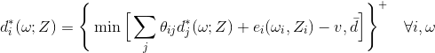
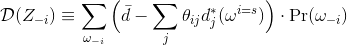
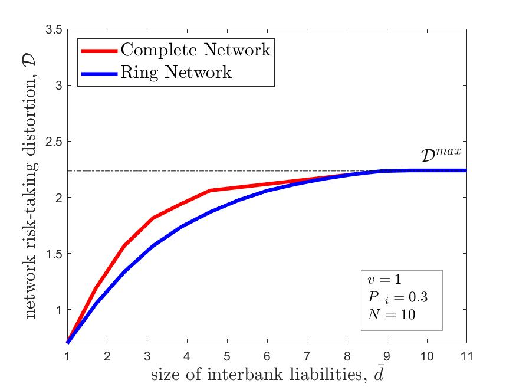
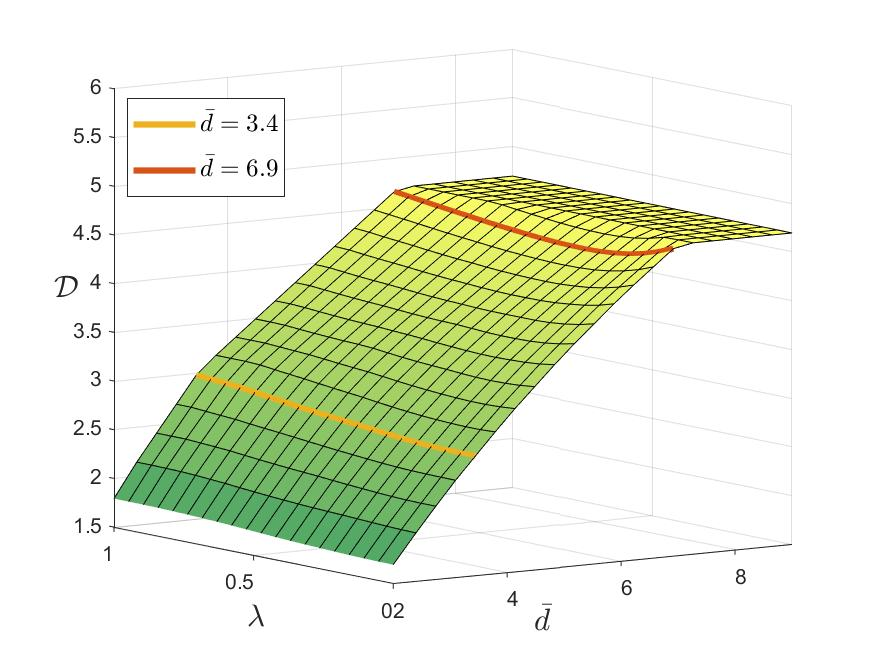
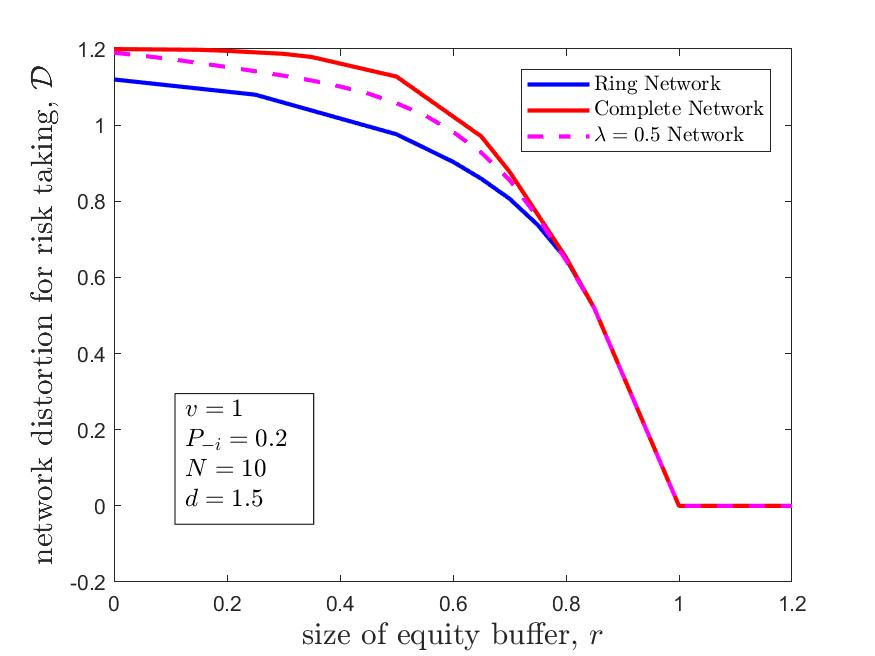

# Replication Code for Shu (2020)
Shu, Chong 2019 "Endogenous Risk-Exposure and Systemic Instability". Paper available at <a href ='https://papers.ssrn.com/sol3/papers.cfm?abstract_id=3076076'> SSRN </a>

## Abstract
Most research on financial systemic stability assumes an economy in which banks are subject to exogenous shocks, but in practice, banks choose their exposure to risk. This paper studies the determinants of this endogenous risk exposure when banks are connected in a financial network. I show that there exists a network risk-taking externality: connected banks’ choices of risk exposure are strategically complementary. Banks in financial networks, particularly densely connected ones, endogenously expose to greater risks. Furthermore, they choose correlated risks, aggravating the systemic fragility. Banks, however, do have incentives to form networks to protect their charter values. The theory yields several novel perspectives on policy debates.

## Algorithm 

### Payment equilibrium
The payment equilibirum is based on an algorithm proposed by Eisenberg and Noe (2001). In particular, it solves the following fixed point

### Network Distortion
The algorithm calculates the network risk-taking distortion proposed in this paper

## Result

### 3.2 -- Network Distortion for Ring and Complete Network
	
Figure 3.(a)
	
 
	
### 3.3 -- 3D plot for the Network Distortion 

Figure 5
	
 	

### 3.4 -- Irregular Network: European Debt Cross-Holding Example

 	

	
### 4.2 -- Capital Requirement
	
Figure 6

 

	
	
	
	
	
	
	
	
	